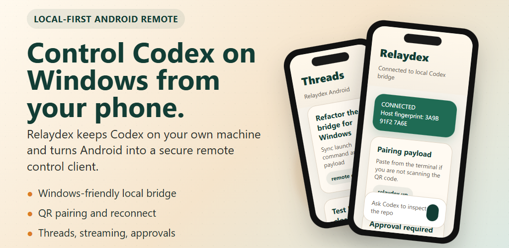

<p align="center">
  
</p>

# Relaydex

[Japanese README](README.ja.md)

Fork of [Remodex](https://github.com/Emanuele-web04/remodex) focused on one concrete workflow:

- run local Codex on Windows
- start a local bridge with `relaydex up`
- control that local Codex session from Android

Relaydex is a local-first bridge plus mobile clients. The Codex runtime stays on your host computer, while the paired phone acts as a remote control client over a relay-backed WebSocket session.

This repository is a monorepo:

- `phodex-bridge/`: the CLI package intended to be published to npm as `relaydex`
- `android/`: the Android client intended to be distributed as a standalone paid app
- `CodexMobile/`: the upstream iOS app source kept for protocol reference and compatibility work

Right now, the default flow still depends on `api.phodex.app` unless you self-host a compatible relay.

## Credits and Status

Relaydex is an independent fork of [Remodex](https://github.com/Emanuele-web04/remodex), originally created by Emanuele Di Pietro.

This repository is not the official Remodex app and is not affiliated with or endorsed by the upstream author.

The goal of this fork is narrower and explicit:

- keep the upstream bridge/protocol ideas
- add Android client support
- support the Windows host + Android remote-control workflow

## What This Is

Relaydex does **not** run Codex on the phone itself. Instead:

- the host computer runs the local bridge and local Codex runtime
- the phone acts as a paired remote control client
- git and workspace actions still execute on the host machine

## Key Features

- end-to-end encrypted pairing between the Android client and the host bridge
- local-first host workflow: Codex, git, and file operations stay on your Windows machine
- QR pairing and pairing-payload paste
- open existing threads and create new ones from Android
- stream Codex output on the phone while work continues on the host
- approval prompts on Android
- reconnect from a saved pairing
- model and reasoning controls on Android

## Current Release Status

- Windows host bridge is published to npm as `relaydex`
- the official Android Play release is still in preparation
- if you want to try the Android client right now, you can build it yourself from `android/`

The intended host-side flow is:

```sh
npm install -g relaydex
relaydex up
```

Then pair from the Android app.

If you want to build the Android client from source before the Play release, see [Docs/ANDROID_BUILD_FROM_SOURCE.md](Docs/ANDROID_BUILD_FROM_SOURCE.md).

## Install the Bridge

Install from npm:

```sh
npm install -g relaydex
```

To update later:

```sh
npm install -g relaydex@latest
```

## Architecture

```text
[Android or iOS client]
          <-> paired relay WebSocket session <->
[relaydex bridge on host computer]
          <-> stdin/stdout JSON-RPC <->
[codex app-server]
```

Optional host-side integration:

- the Codex desktop app can read persisted sessions from `~/.codex/sessions`
- desktop refresh remains a macOS-only workaround

## Repository Structure

```text
remodex/
|-- phodex-bridge/                # CLI bridge package
|   |-- bin/                      # CLI entrypoints
|   `-- src/                      # Bridge runtime and handlers
|-- android/                      # Android Studio project
|   `-- app/                      # Kotlin + Compose Android client
|-- CodexMobile/                  # Upstream iOS source tree
`-- Docs/                         # Forking and release notes
```

## Windows + Android Quick Start

See [Docs/WINDOWS_ANDROID_QUICKSTART.md](Docs/WINDOWS_ANDROID_QUICKSTART.md).

Short version:

1. Install Node.js and Codex CLI on Windows.
2. Install the bridge package.
3. Run `relaydex up` in the local project directory.
4. Open the Android app.
5. Scan the QR code or paste the pairing payload shown under the QR.

## Commands

### `relaydex up`

Starts the local bridge, launches `codex app-server`, and prints a fresh pairing QR code.

### `relaydex reset-pairing`

Clears the saved trusted-device state so the next `relaydex up` starts a fresh pairing flow.

### `relaydex resume`

Reopens the last active thread in the local Codex desktop app if available.

### `relaydex watch [threadId]`

Tails the rollout log for a thread in real time.

## Android Availability

The Android app is not yet broadly released on Google Play.

Current stance:

- the repository is public now
- the official Play listing is still being prepared
- advanced users can build and test the Android client from source
- if you want the later Play build, you can join the Google Group waitlist

This lets the project be visible early without forcing a public Play rollout before account and contact details are ready.

If you want to track Android release progress:

- closed-test page: `https://ranats.github.io/relaydex/closed-test.html`
- rollout notes: [Docs/CLOSED_TEST_PLAN.md](Docs/CLOSED_TEST_PLAN.md)
- recruitment copy: [Docs/TESTER_RECRUITMENT_COPY.md](Docs/TESTER_RECRUITMENT_COPY.md)
- launch copy: [Docs/LAUNCH_COPY.md](Docs/LAUNCH_COPY.md)

## Try It Now

Right now there are two supported public paths:

1. build the Android app from source and test it yourself
2. join the Google Group waitlist for the later Play closed test

Current waitlist link:

- `https://groups.google.com/g/relaydex-android-testers`

Important:

- joining the Google Group now does **not** by itself advance the Google Play closed-test requirement
- the actual Play opt-in and install step will be shared later, after the Play rollout is ready
- if you want to test immediately, source build is the path to use today

## Self-Hosting

The public repository is meant to stay self-host friendly.

- GitHub source should remain usable without private release secrets
- you can run a local relay or your own hosted relay
- the relay is only a transport hop; Codex still runs on your own machine

Start here:

- [SELF_HOSTING_MODEL.md](SELF_HOSTING_MODEL.md)
- [Docs/self-hosting.md](Docs/self-hosting.md)

## Feedback

Best links to share right now:

- Closed-test guide: `https://ranats.github.io/relaydex/closed-test.html`
- Issues page: `https://github.com/Ranats/relaydex/issues`

Suggested Play Console feedback URL:

- `mailto:saxophonia991@gmail.com`

Suggested Play Console feedback email:

- `saxophonia991@gmail.com`

## Environment Variables

The bridge accepts both `RELAYDEX_*` names and legacy `REMODEX_*` names.

Common ones:

| Variable | Description |
|----------|-------------|
| `RELAYDEX_RELAY` | Override the relay URL |
| `RELAYDEX_CODEX_ENDPOINT` | Connect to an existing Codex WebSocket instead of spawning a local runtime |
| `RELAYDEX_REFRESH_ENABLED` | Enable the macOS desktop refresh workaround explicitly |
| `RELAYDEX_REFRESH_DEBOUNCE_MS` | Adjust refresh debounce timing |
| `RELAYDEX_CODEX_BUNDLE_ID` | Override the Codex desktop bundle ID on macOS |

If you are building from source or self-hosting, set these explicitly instead of assuming hosted defaults.

## Bridge Package

Inside [`phodex-bridge/`](phodex-bridge/), this fork is configured to publish under the npm package name `relaydex`.

Key behavior:

- starts local `codex app-server`
- on Windows, launches through `cmd.exe /d /c codex app-server`
- prints a QR code and raw pairing payload JSON
- forwards JSON-RPC between the host and the paired phone
- handles git and workspace operations locally on the host

## Android App

The Android app lives under [`android/`](android/).

Current fork-specific identifiers:

- app name: `Relaydex`
- package / namespace: `io.relaydex.android`
- pairing deep-link scheme: `relaydex://pair`

The Android client supports:

- QR pairing
- raw pairing-payload paste
- thread list and thread open
- new thread creation
- prompt sending
- streamed Codex output
- approval prompts

To build it before the Play release, see [Docs/ANDROID_BUILD_FROM_SOURCE.md](Docs/ANDROID_BUILD_FROM_SOURCE.md).

## FAQ

**Does this work on Windows?**  
Yes. This fork is specifically focused on the Windows host + Android workflow.

**Does this run Codex on the phone itself?**  
No. Codex runs on the host machine. The phone is only a paired remote client.

**Can I self-host the relay?**  
Yes. That is one of the intended public-repo paths. See [Docs/self-hosting.md](Docs/self-hosting.md).

**What happens if I close the terminal running `relaydex up`?**  
The bridge stops. Start it again to create a new live session.

**How do I force a clean pairing state?**  
Run `relaydex reset-pairing`, then start the bridge again with `relaydex up`.

## Security Notes

The mobile client and bridge use the same end-to-end encrypted session model as upstream Remodex. This fork keeps wire-level compatibility where practical, so some internal field names still say `mac` or `iphone`. Those are protocol leftovers, not actual platform restrictions.

## Forking and Publishing

The upstream project uses the ISC license, so you can fork, modify, and publish your own derivative builds as long as you keep the license and attribution notices.

Read these before public release:

- [Docs/ANDROID_FORK_GUIDE.md](Docs/ANDROID_FORK_GUIDE.md)
- [Docs/CLOSED_TEST_PLAN.md](Docs/CLOSED_TEST_PLAN.md)
- [Docs/WINDOWS_ANDROID_QUICKSTART.md](Docs/WINDOWS_ANDROID_QUICKSTART.md)
- [Docs/LAUNCH_COPY.md](Docs/LAUNCH_COPY.md)
- [Docs/PLAY_STORE_COPY.md](Docs/PLAY_STORE_COPY.md)
- [Docs/PLAY_CONSOLE_SETUP.md](Docs/PLAY_CONSOLE_SETUP.md)
- [Docs/PRIVACY_POLICY.md](Docs/PRIVACY_POLICY.md)
- [Docs/PROMO_CODE_FLOW.md](Docs/PROMO_CODE_FLOW.md)
- [Docs/PROMO_CODE_REQUEST_FORM.md](Docs/PROMO_CODE_REQUEST_FORM.md)
- [Docs/RELEASE_CHECKLIST.md](Docs/RELEASE_CHECKLIST.md)
- [Docs/TESTER_RECRUITMENT_COPY.md](Docs/TESTER_RECRUITMENT_COPY.md)

## License

[ISC](LICENSE)
