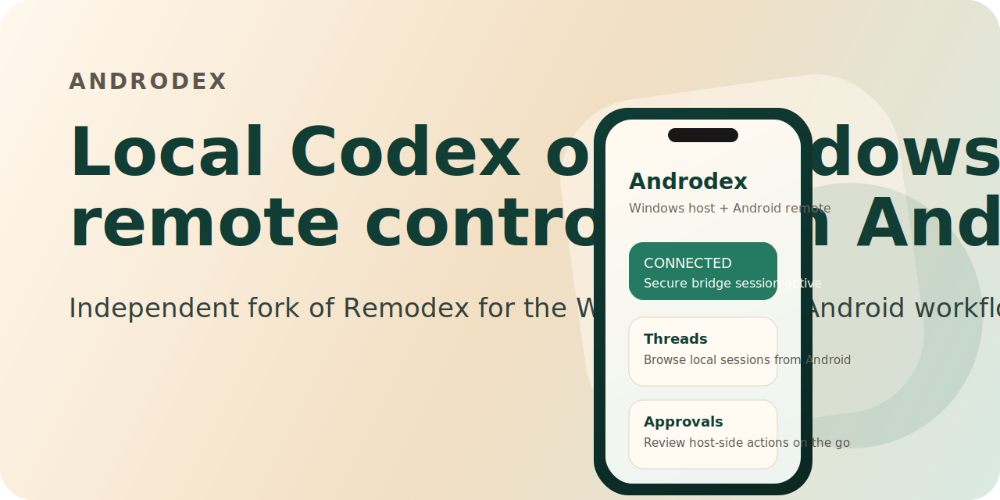

<p align="center">
  
</p>

# Relaydex

Fork of [Remodex](https://github.com/Emanuele-web04/remodex) focused on one concrete workflow:

- run local Codex on Windows
- start a local bridge with `relaydex up`
- control that local Codex session from Android

Relaydex is a local-first bridge plus mobile clients. The Codex runtime stays on your host computer, while the paired phone acts as a remote control client over a relay-backed WebSocket session.

This repository is a monorepo:

- `phodex-bridge/`: the CLI package intended to be published to npm as `relaydex`
- `android/`: the Android client intended to be distributed as a standalone paid app
- `CodexMobile/`: the upstream iOS app source kept for protocol reference and compatibility work

Right now, the default flow still depends on `api.phodex.app` unless you self-host a compatible relay.

## Credits and Status

Relaydex is an independent fork of [Remodex](https://github.com/Emanuele-web04/remodex), originally created by Emanuele Di Pietro.

This repository is not the official Remodex app and is not affiliated with or endorsed by the upstream author.

The goal of this fork is narrower and explicit:

- keep the upstream bridge/protocol ideas
- add Android client support
- support the Windows host + Android remote-control workflow

## What This Is

Relaydex does **not** run Codex on the phone itself. Instead:

- the host computer runs the local bridge and local Codex runtime
- the phone acts as a paired remote control client
- git and workspace actions still execute on the host machine

## Planned Distribution

- Windows host bridge: publish to npm as `relaydex`
- Android client: ship as a separate paid app build from `android/`

The intended user flow after release is:

```sh
npm install -g relaydex
relaydex up
```

Then pair from the Android app.

## Architecture

```text
[Android or iOS client]
          <-> paired relay WebSocket session <->
[relaydex bridge on host computer]
          <-> stdin/stdout JSON-RPC <->
[codex app-server]
```

Optional host-side integration:

- the Codex desktop app can read persisted sessions from `~/.codex/sessions`
- desktop refresh remains a macOS-only workaround

## Repository Structure

```text
remodex/
|-- phodex-bridge/                # CLI bridge package
|   |-- bin/                      # CLI entrypoints
|   `-- src/                      # Bridge runtime and handlers
|-- android/                      # Android Studio project
|   `-- app/                      # Kotlin + Compose Android client
|-- CodexMobile/                  # Upstream iOS source tree
`-- Docs/                         # Forking and release notes
```

## Windows + Android Quick Start

See [Docs/WINDOWS_ANDROID_QUICKSTART.md](Docs/WINDOWS_ANDROID_QUICKSTART.md).

Short version:

1. Install Node.js and Codex CLI on Windows.
2. Install the bridge package.
3. Run `relaydex up` in the local project directory.
4. Open the Android app.
5. Scan the QR code or paste the pairing payload shown under the QR.

## Android Closed Test

Relaydex is preparing for Google Play closed testing.

If you want to help test the Android app:

1. Join the tester group: `https://groups.google.com/g/relaydex-android-testers`
2. Opt in on Google Play: `https://play.google.com/apps/testing/io.relaydex.android`
3. Install the app from Google Play: `https://play.google.com/store/apps/details?id=io.relaydex.android`
4. Keep the app installed and remain opted in for at least 14 days

Notes:

- This is an independent fork of Remodex, not the official Remodex app.
- The Android app is only the remote control client.
- Codex still runs locally on your own computer.

Recruitment and rollout docs:

- Public closed-test page: `https://ranats.github.io/relaydex/closed-test.html`
- [Docs/CLOSED_TEST_PLAN.md](Docs/CLOSED_TEST_PLAN.md)
- [Docs/TESTER_RECRUITMENT_COPY.md](Docs/TESTER_RECRUITMENT_COPY.md)
- [Docs/CLOSED_TEST_LANDING_PAGE.md](Docs/CLOSED_TEST_LANDING_PAGE.md)

## Bridge Package

Inside [`phodex-bridge/`](phodex-bridge/), this fork is configured to publish under the npm package name `relaydex`.

Key behavior:

- starts local `codex app-server`
- on Windows, launches through `cmd.exe /d /c codex app-server`
- prints a QR code and raw pairing payload JSON
- forwards JSON-RPC between the host and the paired phone
- handles git and workspace operations locally on the host

## Android App

The Android app lives under [`android/`](android/).

Current fork-specific identifiers:

- app name: `Relaydex`
- package / namespace: `io.relaydex.android`
- pairing deep-link scheme: `relaydex://pair`

The Android client supports:

- QR pairing
- raw pairing-payload paste
- thread list and thread open
- new thread creation
- prompt sending
- streamed Codex output
- approval prompts

## Security Notes

The mobile client and bridge use the same end-to-end encrypted session model as upstream Remodex. This fork keeps wire-level compatibility where practical, so some internal field names still say `mac` or `iphone`. Those are protocol leftovers, not actual platform restrictions.

## Forking and Publishing

The upstream project uses the ISC license, so you can fork, modify, and publish your own derivative builds as long as you keep the license and attribution notices.

Read these before public release:

- [Docs/ANDROID_FORK_GUIDE.md](Docs/ANDROID_FORK_GUIDE.md)
- [Docs/CLOSED_TEST_PLAN.md](Docs/CLOSED_TEST_PLAN.md)
- [Docs/WINDOWS_ANDROID_QUICKSTART.md](Docs/WINDOWS_ANDROID_QUICKSTART.md)
- [Docs/LAUNCH_COPY.md](Docs/LAUNCH_COPY.md)
- [Docs/PLAY_STORE_COPY.md](Docs/PLAY_STORE_COPY.md)
- [Docs/PLAY_CONSOLE_SETUP.md](Docs/PLAY_CONSOLE_SETUP.md)
- [Docs/PRIVACY_POLICY.md](Docs/PRIVACY_POLICY.md)
- [Docs/RELEASE_CHECKLIST.md](Docs/RELEASE_CHECKLIST.md)
- [Docs/TESTER_RECRUITMENT_COPY.md](Docs/TESTER_RECRUITMENT_COPY.md)

## License

[ISC](LICENSE)
